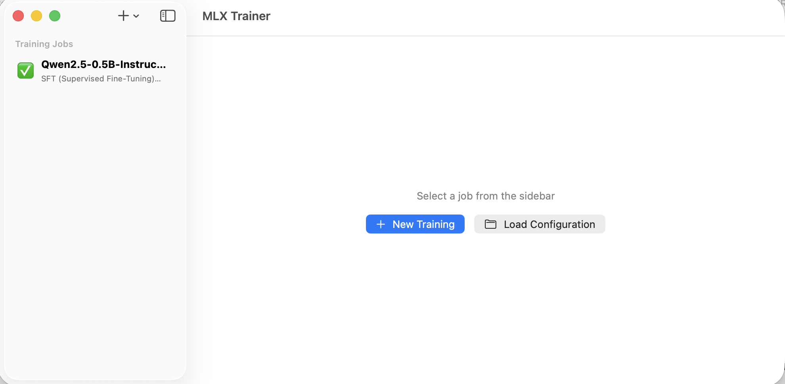
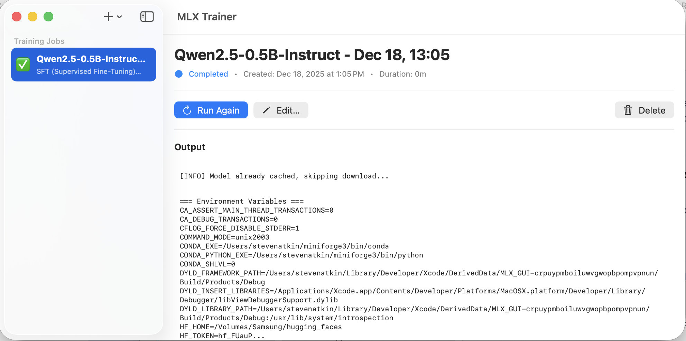

# MLX Training Studio

A macOS GUI application for training language models using Apple's MLX framework and the `mlx-lm-lora` Python package. This application provides an intuitive interface for configuring and managing LoRA (Low-Rank Adaptation) fine-tuning jobs with support for multiple training modes including SFT, DPO, GRPO, CPO, ORPO, and more.

## Table of Contents

- [Overview](#overview)
- [System Requirements](#system-requirements)
- [Important Limitations](#important-limitations)
- [Building from Source](#building-from-source)
- [Getting Started](#getting-started)
  - [Initial Setup](#initial-setup)
  - [Environment Configuration](#environment-configuration)
  - [Hugging Face Token](#hugging-face-token)
  - [Model Storage](#model-storage)
- [Using the Application](#using-the-application)
  - [Creating a Training Job](#creating-a-training-job)
  - [Saving and Loading YAML Configurations](#saving-and-loading-yaml-configurations)
  - [Managing Jobs](#managing-jobs)
  - [Training Modes](#training-modes)
- [Advanced Features](#advanced-features)
  - [Automatic Dataset Downloads](#automatic-dataset-downloads)
  - [Post-Training Quantization \& GGUF Export](#post-training-quantization--gguf-export)
- [Customization](#customization)
  - [Adding Custom Models](#adding-custom-models)
- [Data Format Requirements](#data-format-requirements)
- [Troubleshooting](#troubleshooting)

## Overview

MLX Training Studio simplifies the process of fine-tuning large language models on Apple Silicon Macs. It provides:

- **Visual Configuration Wizard**: Step-by-step interface for setting up training parameters
- **Multiple Training Modes**: Support for SFT, DPO, GRPO, CPO, ORPO, Online DPO, XPO, RLHF, and PPO
- **Job Management**: Create, monitor, pause, resume, and manage multiple training jobs
- **In-Place Job Editing**: Open an existing (non-running) job in the wizard, change settings, and save back into the same job
- **YAML Export/Import**: Save and load training configurations for reproducibility
- **Progress Tracking**: Real-time monitoring of training progress, metrics, and logs
- **Model Download**: Automatic model downloading from Hugging Face with progress tracking
- **Automatic Dataset Handling**: Hugging Face datasets are downloaded automatically by mlx-lm-lora during training
- **Post-Training Quantization**: Optionally quantize the fused model to 4-bit or 8-bit MLX format after training
- **GGUF Export (Optional)**: Convert a fused full-precision model to GGUF using `llama.cpp`'s `convert_hf_to_gguf.py`, with selectable output types
- **Error Detection**: Intelligent error parsing with helpful suggestions for common issues

Under the hood, MLX Training Studio builds on:

- **MLX / `mlx-lm`** for efficient model execution and conversion on Apple Silicon ([`mlx`](https://github.com/ml-explore/mlx), [`mlx-lm`](https://github.com/ml-explore/mlx-lm))
- **`mlx-lm-lora`** for training loops, data handling, and YAML-driven configuration ([`mlx-lm-lora`](https://github.com/Goekdeniz-Guelmez/mlx-lm-lora))
- **`llama_cpp` / `llama.cpp`** for Hugging Face → GGUF conversion workflows ([`llama_cpp`](https://github.com/shamitv/llama_cpp))  

The goal of this app is to **simplify access** to these tools by:

- Managing Python environments and dependencies for you
- Providing a GUI for editing `mlx-lm-lora` YAML configurations
- Orchestrating model/dataset downloads, fusing adapters, post-training quantization, and optional GGUF export without requiring you to run shell commands by hand.

## System Requirements

- **macOS**: 13.0 (Ventura) or later
- **Hardware**: Apple Silicon Mac (M1, M2, M3, or later)
- **Xcode**: 15.0 or later (for building from source)
- **Python**: Python 3.12 or later (see [Important Limitations](#important-limitations))
- **Memory**: Sufficient RAM for the model you're training (varies by model size)

## Important Limitations

### Sandboxing

**⚠️ This application cannot run in sandboxed mode.** The app requires unrestricted file system access to:

- Execute Python processes and manage virtual environments
- Access model cache directories (including `HF_HOME` if set)
- Read/write training data and configuration files
- Save trained adapters and checkpoints

If you're building from source, ensure that `ENABLE_APP_SANDBOX = NO` in your Xcode project settings.

### Python Requirements

**⚠️ You must have a full Python installation, not the default Python that macOS ships with.**

The default Python that comes with macOS (`/usr/bin/python3`) is a stub that only redirects to Python installed via the App Store or developer tools, and it lacks the necessary features for creating virtual environments and installing packages.

**Recommended Python installations:**
- **Homebrew**: `brew install python@3.12` (installs to `/opt/homebrew/bin/python3` or `/usr/local/bin/python3`)
- **pyenv**: `pyenv install 3.12` (manages multiple Python versions)
- **Official Python.org installer**: Download from [python.org](https://www.python.org/downloads/)

**To verify your Python installation:**
```bash
python3 --version  # Should show Python 3.8 or later
which python3      # Should not be /usr/bin/python3
```

### Quantization & GGUF Limitations

- **Post-Training Quantization (MLX format)**:
  - Implemented using `mlx_lm.convert` inside the app's managed virtual environment.
  - Works best when the **base model is full-precision** (BF16/FP16).
  - If the base model identifier already indicates quantization (e.g., contains `4bit`, `8bit`, or `6bit`), the app:
    - Skips re-quantization and instead **copies the fused model** to the configured quantized output path.
    - Logs a message explaining that the base is already quantized.

- **GGUF Conversion (via `llama.cpp`)**:
  - Requires a **non-quantized base model** (e.g., BF16/FP16 Hugging Face checkpoint).
  - The app **blocks GGUF conversion** if the base model id appears quantized (`4bit`, `8bit`, `6bit`, `3bit`, `awq`, `gptq`, `bnb`, `kbit`, etc.).
  - This matches `llama.cpp`'s intended usage: convert **original HF models**, not GPTQ/AWQ/other quantized repos.
  - Input model is always the **fused Hugging Face-style directory** at the adapter path (base + LoRA adapters merged).
  - Only the `--outtype` values supported by your `convert_hf_to_gguf.py` are exposed in the UI: `auto`, `f32`, `f16`, `bf16`, `q8_0`, `tq1_0`, `tq2_0`.

## Building from Source

This application is distributed as source code only. You'll need to build it using Xcode on your Mac.

### Prerequisites

1. **Install Xcode**:
   - Download Xcode from the Mac App Store or [developer.apple.com](https://developer.apple.com/xcode/)
   - Xcode 15.0 or later is required
   - Open Xcode and accept the license agreement
   - Install additional components when prompted (Command Line Tools)

2. **Verify Xcode Installation**:
   ```bash
   xcodebuild -version  # Should show Xcode version
   ```

### Building the Application

1. **Get the Source Code**:
   - If using Git: Clone the repository and navigate to the directory
     ```bash
     git clone [repository-url]
     cd mlx-lm-gui
     ```
   - Or download and extract the source code ZIP file from the repository

2. **Open the Project in Xcode**:
   - Double-click `MLX GUI.xcodeproj` to open it in Xcode
   - Or open Xcode and select File → Open, then navigate to `MLX GUI.xcodeproj`

3. **Configure Signing (Optional)**:
   - Select the "MLX GUI" target in the project navigator
   - Go to the "Signing & Capabilities" tab
   - If you have an Apple Developer account, select your team
   - If you don't have a developer account, Xcode will automatically create a local signing certificate
   - **Note**: The app is configured with `ENABLE_APP_SANDBOX = NO` which is required for the app to function

4. **Build and Run**:
   - Press ⌘R (or click the Play button) to build and run the app
   - Xcode will compile the project and launch the application
   - The first build may take a few minutes

5. **Create a Local Install** (Optional):
   
   If you want to install the app to your Applications folder for easier access:
   
   **Method 1: Archive and Export** (For creating a distributable build):
   - In Xcode, select Product → Archive
   - Wait for the archive to complete
   - In the Organizer window, click "Distribute App"
   - Select "Direct Distribution" or "Custom" method
   - Follow the prompts to export the app to a location of your choice
   - Drag the exported `.app` bundle to your Applications folder
   
   **Method 2: Build for Running** (Simpler, recommended for local use):
   - In Xcode, select Product → Build (⌘B)
   - Find the built app:
     - In Xcode's Project Navigator, expand "Products" and right-click "MLX GUI.app", then select "Show in Finder"
     - Or locate it manually: `~/Library/Developer/Xcode/DerivedData/MLX_GUI-[hash]/Build/Products/Debug/MLX GUI.app`
   - Copy the `.app` bundle to your Applications folder:
     ```bash
     # Using the path from "Show in Finder"
     cp -R "/path/to/MLX GUI.app" /Applications/
     ```
   - Or simply drag the app from Finder to your Applications folder

### First Launch

On first launch, macOS may warn about running an app from an unidentified developer. You may need to:

- Right-click the app and select "Open", then confirm in the dialog
- Or go to System Settings → Privacy & Security and click "Open Anyway"
- Or if running from Xcode, this warning typically doesn't appear

### Troubleshooting Build Issues

- **"No such module" errors**: Make sure all source files are included in the Xcode project
- **Code signing errors**: Ensure you have a valid signing certificate (Xcode can create one automatically)
- **Build fails with Swift errors**: Check that you're using Xcode 15.0 or later
- **Sandboxing errors**: The project is configured with `ENABLE_APP_SANDBOX = NO` - do not enable sandboxing as the app requires unrestricted file system access

## Getting Started

### Initial Setup

When you first launch MLX Training Studio, you'll see a setup screen if your environment isn't configured. Follow these steps to get started:

### Environment Configuration

Open **Settings** (⌘, or App Menu → Settings) to configure your Python environment:

#### 1. Python Interpreter

1. **Set Python Path**: Enter the path to your Python 3 installation
   - **Example paths**:
     - Homebrew: `/opt/homebrew/bin/python3` or `/usr/local/bin/python3`
     - pyenv: `~/.pyenv/shims/python3`
     - Custom installation: Use the "Browse…" button to locate it
   
2. **Verify Python**: Click "Detect" to verify the Python installation
   - The app will check that Python 3.12+ is installed
   - It will also verify that `pip` is available

3. **Troubleshooting**: If detection fails:
   - Verify `python3 --version` works in Terminal
   - Ensure you're not using the macOS stub Python (`/usr/bin/python3`)
   - Try using "Browse…" to manually select your Python executable

#### 2. Create Virtual Environment

1. Click **"Create venv"** button
   - This creates an isolated Python environment in:
     ```
     ~/Library/Application Support/MLX Training Studio/venv
     ```
   - The virtual environment ensures dependencies don't conflict with system Python

2. Wait for creation to complete (check the Output Log)

#### 3. Install Dependencies

1. Click **"Install/Update mlx-lm-lora"** button
   - This installs:
     - `mlx-lm-lora` (the training framework)
     - `mlx-lm` (MLX language model utilities)
     - `huggingface-hub` (for model downloads)
     - All required dependencies

2. Installation may take several minutes depending on your internet connection

3. Check the Output Log for progress and any errors

#### 4. Smoke Test (Optional)

1. Click **"Run Smoke Test"** to verify everything is working
   - This runs a quick test to ensure `mlx-lm-lora` is properly installed
   - Check the Output Log for confirmation


### Hugging Face Token

To download models from Hugging Face (especially private models or gated models), you need an access token:

1. **Get a token**:
   - Visit [https://huggingface.co/settings/tokens](https://huggingface.co/settings/tokens)
   - Create a new token (read access is sufficient for most models)
   - Copy the token

2. **Enter in Settings**:
   - Open Settings (⌘,)
   - In the "Hugging Face" section, paste your token into the "HF Token" field
   - The token is saved securely in your macOS Keychain (via UserDefaults)

3. **Token is optional**:
   - Public models can be downloaded without a token
   - However, a token may provide higher download rate limits
   - Some models require authentication (gated models)

*The HF Token field is shown in the Settings screenshot above.*

### Model Storage

The application respects the `HF_HOME` environment variable if set in your shell. Otherwise, models are downloaded to the default Hugging Face cache location.

**Default location** (if `HF_HOME` is not set):
```
~/.cache/huggingface/hub/models--org--model/
```

**Custom location** (if `HF_HOME` is set):
```
$HF_HOME/hub/models--org--model/
```

**To set a custom location:**
1. Add to your `~/.zshrc` or `~/.bash_profile`:
   ```bash
   export HF_HOME="/path/to/your/custom/location"
   ```
2. Restart the application (or restart your Terminal if launching from command line)

**Note**: The app loads your shell environment variables when starting training jobs, so `HF_HOME` will be respected if set in your shell configuration.

## Using the Application

### Creating a Training Job

1. **Open the Training Wizard**:
   - Click the "+" button in the toolbar
   - Or select "New Training" from the File menu

2. **Follow the Wizard Steps**:

   **Step 1: Basic Settings**
   - **Job Name** (required): Enter a name for this training job
     - A default name is auto-generated (model identifier + timestamp)
     - The field is marked with a red asterisk (*) to indicate it's required
   - **Model**: Select from the popular models list or enter a Hugging Face model identifier
     - Popular models are from `mlx-community` on Hugging Face
     - Examples: `mlx-community/Qwen2.5-7B-Instruct-4bit`
   - **Data Path**: Select the directory containing your training data
     - Must contain `train.jsonl`, `valid.jsonl`, and optionally `test.jsonl`
   - **Training Mode**: Select the training mode (see [Training Modes](#training-modes))
   - **Adapter Path** (optional): Path to a pre-trained adapter to continue training

   **Step 2: Training Parameters**
   - Batch size, learning rate, iterations, max sequence length
   - Gradient accumulation steps and gradient checkpointing options
   - Validation & reporting settings (validation batches, steps per report/eval, save frequency)
   - Resume training from existing adapter weights

   **Step 3: LoRA Parameters**
   - Rank, dropout, scale, and target layers for LoRA adaptation

   **Step 4: Optimizer**
   - Optimizer type (AdamW, Adam, QHAdam, Muon)
   - Weight decay (for AdamW optimizer)
   - Learning rate schedule (cosine decay, linear, constant)
   - Warmup steps and warmup initial learning rate

   **Step 5: Mode-Specific Parameters**
   - Parameters specific to your selected training mode
   - For example: DPO beta, GRPO group size, etc.

   **Step 6: Advanced Options**
   - **Model Quantization at Load Time**:
     - Choose whether to load the base model in 4-bit or 8-bit mode (or leave unquantized).
   - **Weights & Biases Integration**:
     - Optional project name for logging to Weights & Biases.
   - **Test Mode**:
     - Run a limited number of batches to verify the configuration before a full run.
   - **Additional Command-Line Arguments**:
     - Advanced escape hatch: extra CLI flags appended when calling `mlx_lm_lora.train`.
   - **Post-Training Quantization (MLX format)**:
     - Enable a second stage where the fused model is quantized after training completes.
     - Choose quantization type (4-bit or 8-bit) and configure the output directory.
   - **GGUF Conversion (Optional)**:
     - If `llama.cpp` is configured in Settings, you can enable conversion of the fused model to GGUF.
     - Choose the GGUF output type (`auto`, `f32`, `f16`, `bf16`, `q8_0`, `tq1_0`, `tq2_0`) and output path.

   **Step 7: Review**
   - Review all settings
   - Save configuration to YAML (optional)
   - Create the job

3. **Start Training**:
   - After creating the job, it appears in the job list
   - Click the "Play" button to start training
   - Monitor progress in real-time in the job details view


### Saving and Loading YAML Configurations

The application supports saving and loading training configurations as YAML files for reproducibility and sharing.

#### Saving a Configuration

1. **During Job Creation**:
   - In the Review step (Step 7) of the training wizard
   - Click "Save YAML Configuration…" button
   - Choose a location and filename
   - The configuration is saved as a standard YAML file compatible with `mlx-lm-lora`

2. **From an Existing Job**:
   - Each job automatically saves its YAML configuration when created
   - Configurations are stored in:
     ```
     ~/Library/Application Support/MLX Training Studio/configs/
     ```

#### Loading a Configuration

1. **Open the Load Dialog**:
   - Click the "+" button in the toolbar
   - Select "Load Configuration" from the menu
   - Or use the "Load Configuration" button in the empty state

2. **Select YAML File**:
   - Navigate to your YAML configuration file
   - Click "Open"

3. **Edit in Wizard**:
   - The configuration is loaded into the training wizard
   - You can review and modify any settings
   - Create a new job with the loaded configuration

**YAML Format**: The YAML files are fully compatible with `mlx-lm-lora` configuration format and can be used directly with the command-line tool (`python -m mlx_lm_lora.train -c config.yaml`). App-specific options (post-training quantization, GGUF conversion) are clearly marked in the YAML output.

*The Review step screenshot above shows the YAML configuration preview and save options.*

### Managing Jobs

- **View Jobs**: All training jobs appear in the sidebar
- **Select Job**: Click a job to view details, output, and metrics
- **Start Job**: Click the "Play" button to start or resume training
- **Stop Job**: Click the "Stop" button to pause training (can be resumed)
- **Delete Job**: Click the "Delete" button to remove a job (this also deletes its configuration file)
- **Run Again**: Click "Run Again" to reset a completed job and run it again
- **Edit Existing Job**: For any non-running job (Pending, Completed, Failed, Cancelled), click "Edit…" to:
  - Open the Training Wizard with that job's configuration pre-filled.
  - Change any settings (including model, data, modes, quantization, GGUF export).
  - Save changes back into the same job (previous output and metrics are cleared, status resets to Pending).
- **View Output**: Scroll through the output log to see training progress, metrics, and any errors
- **View Metrics**: Training metrics are displayed in a formatted table

**Job Statuses**:
- ⏸️ **Pending**: Job created but not started
- ▶️ **Running**: Training in progress
- ⏹️ **Stopped**: Training paused (can be resumed)
- ✅ **Completed**: Training finished successfully
- ❌ **Failed**: Training encountered an error (click to view error details)





### Training Modes

The application supports the following training modes:

| Mode | Description | Reference Model Required | Judge Model Required |
|------|-------------|-------------------------|---------------------|
| **SFT** | Supervised Fine-Tuning | No | No |
| **DPO** | Direct Preference Optimization | Yes | No |
| **CPO** | Contrastive Preference Optimization | Yes | No |
| **ORPO** | Odds Ratio Preference Optimization | No | No |
| **GRPO** | Group Relative Policy Optimization | No | No |
| **GSPO** | GRPO with Importance Sampling | No | No |
| **Dr. GRPO** | Decoupled Rewards GRPO | No | No |
| **DAPO** | Dynamic Adaptive Policy Optimization | No | No |
| **Online DPO** | Online DPO with real-time feedback | Yes | Yes |
| **XPO** | Extended Preferences | Yes | Yes |
| **RLHF Reinforce** | RLHF with REINFORCE algorithm | Yes | Yes |
| **PPO** | Proximal Policy Optimization | Yes | Yes |

Each mode has specific data format requirements. See [Data Format Requirements](#data-format-requirements) for details.

*The mode selection is shown in the Training Wizard Basic Settings screenshot above.*

## Advanced Features

### Dataset Handling

- When you specify a **Hugging Face dataset id** (for example `mlx-community/wikisql`) as the data path:
  - The `mlx-lm-lora` training framework handles dataset downloads automatically via the Python `datasets` library.
  - Download progress is shown in the training output.
  - Datasets are cached under `HF_HOME/datasets/` for reuse across runs.
- **Note**: Hugging Face datasets must already be in a supported format (with train/valid/test splits). Pre-formatted datasets from `mlx-community` are recommended.
- Environment variables respected:
  - `HF_TOKEN` for private/gated datasets (set in Settings)
  - `HF_HOME` from your shell environment

### Post-Training Quantization & GGUF Export

#### Post-Training Quantization (MLX format)

- In the Advanced step of the wizard, you can enable **Post-Training Quantization**:
  - The app will **fuse** the base model and LoRA adapters (if any) and then call `mlx_lm.convert` in the managed venv.
  - Supported post-training quantization types:
    - **4-bit**
    - **8-bit**
  - You can configure a **Quantized Model Path**:
    - If omitted and an adapter path is set, it defaults to `adapter_path/quantized`.
    - If no adapter path is set, a reasonable default under Application Support is used.
- Behavior with pre-quantized base models:
  - If the base model is already quantized (name contains `4bit`, `8bit`, `6bit`, or config.json has quantization info), the app:
    - Skips re-quantization entirely to avoid incompatible weights.
    - Logs a clear message explaining that the fused model is already quantized.

#### GGUF Export via `llama.cpp` (Optional)

- GGUF conversion is **optional** and disabled by default.
- To enable it:
  1. Clone `llama.cpp` somewhere on your system (for example `~/Development/llama.cpp`).
  2. In **Settings → GGUF Conversion (Optional)**, set the **llama.cpp Path** to that directory.
  3. The app validates that `convert_hf_to_gguf.py` exists there and installs required Python dependencies
     (e.g., `torch`, `transformers`, `safetensors`, `numpy`, `sentencepiece`, `protobuf`) into the managed venv.
- Once configured, the Advanced step of the wizard allows you to:
  - Enable **Convert to GGUF after training**.
  - Choose a **GGUF Output Type** (`auto`, `f32`, `f16`, `bf16`, `q8_0`, `tq1_0`, `tq2_0`).
  - Set a **GGUF Output Path** (file or directory). If you provide a directory, the app creates a descriptive filename
    based on the base model id (for example, `Phi-3.5-mini-instruct-mlx-trained.gguf`).
- What is converted:
  - The app always converts the **fused Hugging Face-style model directory** at the adapter path (base + adapters merged).
  - GGUF export automatically enables fuse for the training run if it is not already enabled.
- Restrictions and known limitations:
  - **Base model must be full-precision (BF16/FP16)**:
    - If the base model id appears quantized (`4bit`, `8bit`, `6bit`, `3bit`, `awq`, `gptq`, `bnb`, `kbit`, etc.), the app:
      - Skips GGUF conversion.
      - Logs a warning explaining that only non-quantized base models are supported for GGUF export.
  - Only the `--outtype` values accepted by your `convert_hf_to_gguf.py` are exposed in the UI.
  - GGUF conversion runs in a background task and streams progress into the job output, so the app remains responsive.

## Customization

### Adding Custom Models

You can add your own models to the model selection dropdown:

1. **Create Custom Models File**:
   - Create a file named `custom_models.json` in:
     ```
     ~/Library/Application Support/MLX Training Studio/custom_models.json
     ```

2. **JSON Format**:
   ```json
   {
     "models": [
       {
         "identifier": "your-org/your-model-name",
         "displayName": "Your Model Display Name"
       },
       {
         "identifier": "another-org/another-model",
         "displayName": "Another Model"
       }
     ]
   }
   ```

3. **Restart the App**:
   - Close and reopen MLX Training Studio
   - Your custom models will appear in the dropdown along with the default models

**Notes**:
- Custom models are merged with bundled models
- If a custom model has the same identifier as a bundled model, the bundled model takes precedence
- You can always enter any Hugging Face model identifier manually in the text field, even if it's not in the list
- Visit [https://huggingface.co/mlx-community](https://huggingface.co/mlx-community) to see all available MLX models


## Data Format Requirements

Training data must be in JSONL format (one JSON object per line) with files named `train.jsonl`, `valid.jsonl`, and optionally `test.jsonl`.

### SFT (Supervised Fine-Tuning)

**Format**: `{"prompt": "...", "completion": "..."}`

**Example**:
```jsonl
{"prompt": "What is machine learning?", "completion": "Machine learning is a subset of artificial intelligence..."}
{"prompt": "Explain neural networks", "completion": "Neural networks are computing systems inspired by..."}
```

**Alternative formats** (also supported):
- Chat format: `{"messages": [{"role": "user", "content": "..."}, {"role": "assistant", "content": "..."}]}`
- Text format: `{"text": "full text content"}`

See `sample_data/README.md` for SFT sample files.

### DPO (Direct Preference Optimization)

**Format**: `{"prompt": "...", "chosen": "...", "rejected": "..."}`

**Example**:
```jsonl
{"prompt": "Write a helpful response", "chosen": "Here's a detailed explanation...", "rejected": "I don't know"}
{"prompt": "Answer this question", "chosen": "The answer is...", "rejected": "Maybe"}
```

See `sample_data/DPO_README.md` for DPO sample files.

### GRPO (Group Relative Policy Optimization)

**Format**: `{"prompt": "...", "answer": "..."}`

**Example**:
```jsonl
{"prompt": "Question about topic", "answer": "Response to question"}
{"prompt": "Another question", "answer": "Another response"}
```

See `sample_data/GRPO_README.md` for GRPO sample files.

### Other Modes

Refer to the `mlx-lm-lora` documentation for format requirements for other training modes (CPO, ORPO, PPO, etc.).

**Important Notes**:
- Files must be named exactly: `train.jsonl`, `valid.jsonl`, `test.jsonl` (not `training.jsonl` or `validation.jsonl`)
- Each line must be valid JSON
- No trailing empty lines in JSONL files
- The application provides helpful error messages if data format doesn't match the selected training mode


## Troubleshooting

### "Python not found" or "Python detection failed"

- **Problem**: The app can't find a valid Python installation
- **Solution**:
  - Verify `python3 --version` works in Terminal
  - Ensure you're not using `/usr/bin/python3` (the macOS stub)
  - Install Python via Homebrew: `brew install python@3.12`
  - Manually browse to your Python executable in Settings

### "Virtual environment creation failed"

- **Problem**: Can't create the virtual environment
- **Solution**:
  - Ensure your Python installation has `venv` module: `python3 -m venv --help`
  - Check that the app has write permissions to Application Support directory
  - Try running the command manually in Terminal to see detailed errors

### "mlx-lm-lora installation failed"

- **Problem**: Package installation errors
- **Solution**:
  - Check your internet connection
  - Verify `pip` is working: `python3 -m pip --version`
  - Try installing manually: `python3 -m pip install mlx-lm-lora`
  - Check the Output Log in Settings for detailed error messages

### "Model download failed" or "RepositoryNotFoundError"

- **Problem**: Can't download model from Hugging Face
- **Solution**:
  - Verify your HF token is set correctly in Settings (for private/gated models)
  - Check that the model identifier is correct
  - Verify internet connection
  - Try downloading the model manually using `huggingface-cli` to test

### "KeyError" or "Data format mismatch"

- **Problem**: Training data doesn't match the expected format for the selected mode
- **Solution**:
  - Check the [Data Format Requirements](#data-format-requirements) section
  - Ensure JSONL files are correctly formatted (one JSON object per line)
  - Verify required keys are present (`prompt`, `completion` for SFT; `prompt`, `chosen`, `rejected` for DPO; etc.)
  - Remove any trailing empty lines from JSONL files
  - The app displays helpful error messages with suggestions - read them carefully

### "Cannot connect to Python process" or process errors

- **Problem**: Training job fails to start or stops unexpectedly
- **Solution**:
  - Check that the virtual environment still exists
  - Verify `mlx-lm-lora` is still installed (run "Run Smoke Test" in Settings)
  - Check the job output log for detailed error messages
  - Ensure sufficient disk space for model downloads and checkpoints

### Training is very slow

- **Problem**: Training takes longer than expected
- **Solution**:
  - Use a smaller model for testing (e.g., 0.5B or 1.5B parameter models)
  - Reduce batch size
  - Reduce `max_seq_length` if using very long sequences
  - Ensure you're using a quantized model (4-bit or 8-bit) for faster training
  - Check Activity Monitor to ensure the process is using GPU (Apple Neural Engine)

### App crashes on launch or during use

- **Problem**: Unexpected crashes
- **Solution**:
  - Check Console.app for crash logs
  - Ensure macOS is up to date
  - Try deleting and recreating the virtual environment
  - Check available disk space

### Models downloaded to wrong location

- **Problem**: Models aren't where you expect them
- **Solution**:
  - Check if `HF_HOME` is set in your shell environment
  - Default location: `~/.cache/huggingface/hub/`
  - Custom location: `$HF_HOME/hub/`
  - Models are stored in: `models--org--model/snapshots/[commit-hash]/`

## Additional Resources & Acknowledgements

MLX Training Studio is built on top of, and inspired by, several excellent open-source projects:

- **MLX Framework** (`mlx`): Core array and neural network primitives for Apple Silicon  
  [https://github.com/ml-explore/mlx](https://github.com/ml-explore/mlx)

- **MLX Language Models** (`mlx-lm`): Reference implementations and utilities for running and converting language models with MLX  
  [https://github.com/ml-explore/mlx-lm](https://github.com/ml-explore/mlx-lm)

- **MLX-LM-LoRA** (`mlx-lm-lora`): High-level training library that powers all training in this app.  
  The GUI acts as a front-end for `mlx-lm-lora`, generating YAML configs and invoking `mlx_lm_lora.train` for you, so you can use the full feature set without touching the CLI.  
  [https://github.com/Goekdeniz-Guelmez/mlx-lm-lora](https://github.com/Goekdeniz-Guelmez/mlx-lm-lora)

- **llama_cpp Python Package**: A Python wheel packaging `llama.cpp` and its conversion scripts, including helpers such as `install_conversion_libs` and `convert_hf_to_gguf` for Hugging Face → GGUF conversion with quantization options like `f16`, `q8_0`, etc.  
  Our GGUF export flow follows the same underlying `convert_hf_to_gguf.py` mechanism, but wraps it in a macOS GUI that manages environments, dependencies, paths, and arguments for you.  
  [https://github.com/shamitv/llama_cpp](https://github.com/shamitv/llama_cpp)

- **Hugging Face MLX Community**: A rich catalog of MLX-ready models  
  [https://huggingface.co/mlx-community](https://huggingface.co/mlx-community)

- **Sample Training Data**: See `sample_data/` directory for example JSONL files

## License

This project is licensed under the **Apache License, Version 2.0**.

You may obtain a copy of the License at:

`LICENSE` (included in this repository) or online at  
<https://www.apache.org/licenses/LICENSE-2.0>

Unless required by applicable law or agreed to in writing, software
distributed under the License is distributed on an "AS IS" BASIS,
WITHOUT WARRANTIES OR CONDITIONS OF ANY KIND, either express or implied.
See the `LICENSE` file for the specific language governing permissions
and limitations under the License.

## Contributing

[Add contribution guidelines if applicable]

## Support

For issues, questions, or feature requests, please [open an issue on GitHub](../../issues).

---

**Note**: This application is designed for macOS and requires Apple Silicon. Intel Macs are not supported due to MLX framework requirements.

